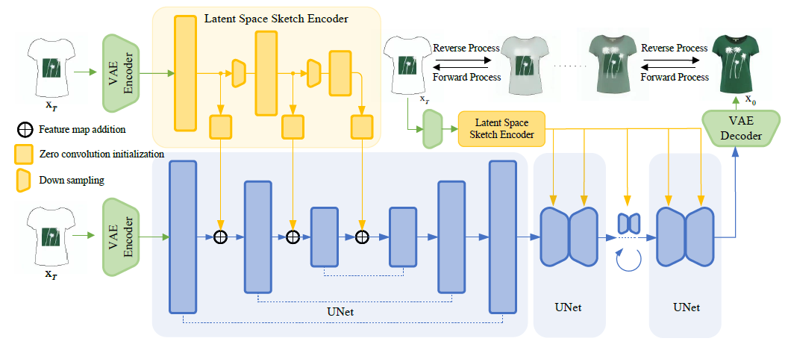
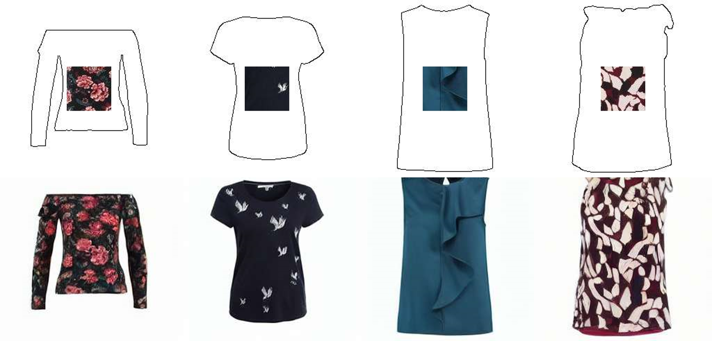

# Controllable Fashion Rendering via Brownian Bridge Diffusion Model with Latent Sketch Encoding
This repository is the official implementation of "Controllable Fashion Rendering via Brownian Bridge Diffusion Model with Latent Sketch Encoding". The work is currently being submitted to [The Visual Computer](https://link.springer.com/journal/371)


## Prerequisites
We tested the code on Ubuntu 22.04. You can use the following command to clone the code and install the required dependencies. Our code is based on the [diffuser](https://github.com/huggingface/diffusers) library.
```
git clone https://github.com/wzm206/FashionBBDM.git
cd FashionBBDM
pip install -r requirements.txt
```
## Quick start
We prepared the required conditional images for inference demonstrations in the `demo_input` folder. You need to download the pre trained model that has already been trained from the link below first.

[FashionBBDM](https://huggingface.co/wzm206/FashionBBDM/tree/main)

Create the `model_weight` folder in the root directory of the project and move all files of the pre-trained model into it. Then run `python sample.py`. The generated clothing images are output to the `output` folder by default. The output result should be as shown in the following figure.




## Training
### Prepare the dataset
We used the fashion dataset in [FashionGAN: Display your fashion design using Conditional Generative Adversarial Nets](https://onlinelibrary.wiley.com/doi/abs/10.1111/cgf.13552) and shoe dataset collected in [image-to-image translation with conditional adversarial networks](https://phillipi.github.io/pix2pix/).

Organize the files in the dataset into the following format

```
├── source
│   ├── 1.png
│   └── 2.png
├── target
      ├── 1.png
      └── 2.png
```

If you are using a clothing dataset, you can use the following script:
```
import os
import cv2
img_ori_path = "path"
output_pathA = "path"

img_name_list = os.listdir(img_ori_path)

for i, now_name in enumerate(img_name_list):
    ori_path = os.path.join(img_ori_path, now_name)
    AB = cv2.imread(ori_path)
    A = AB[:, :256]
    B = AB[:, 256:]
    A[96:96+64, 96:96+64] = B[96:96+64, 96:96+64]
    cv2.imwrite(os.path.join(output_pathA, "source", now_name), A)
    cv2.imwrite(os.path.join(output_pathA, "target", now_name), B)
```
### Train
Start training using the following command
```
export MODEL_NAME="/path/to/stable-diffusion-v1-5"
CUDA_VISIBLE_DEVICES=0 accelerate launch train.py \
  --pretrained_model_name_or_path=$MODEL_NAME \
  --train_data_dir /path/to/data \
  --resolution=256 \
  --random_flip \
  --train_batch_size=32 \
  --gradient_checkpointing \
  --learning_rate=2e-5 \
  --max_grad_norm=1 \
  --lr_scheduler="constant" --lr_warmup_steps=0 \
  --output_dir="logs/FashionBBDM" \
  --num_train_epochs 200 \
  --checkpointing_steps 1000
```

## Acknowledgments
This implementation is heavily inspired by [BBDM](https://github.com/xuekt98/BBDM).
